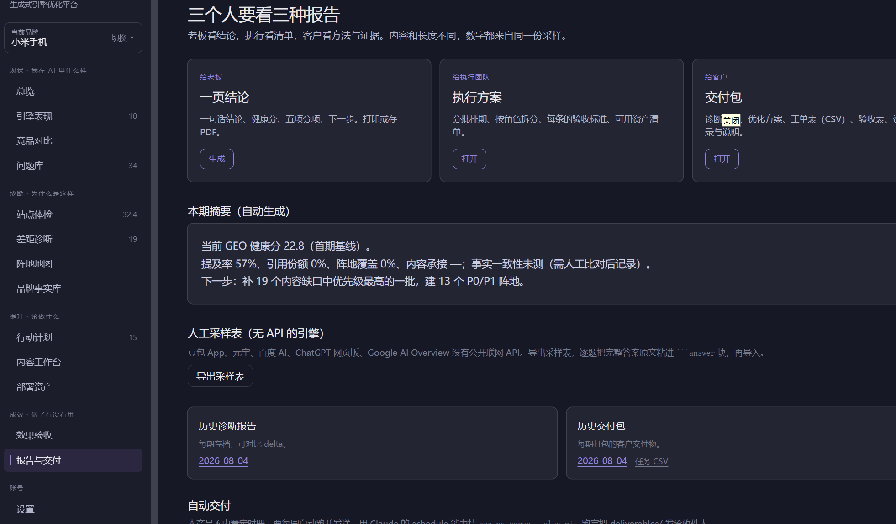
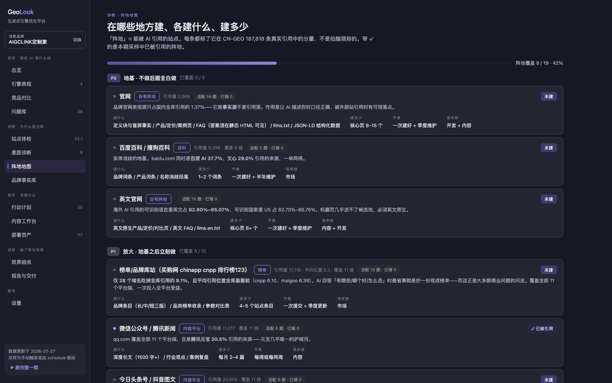
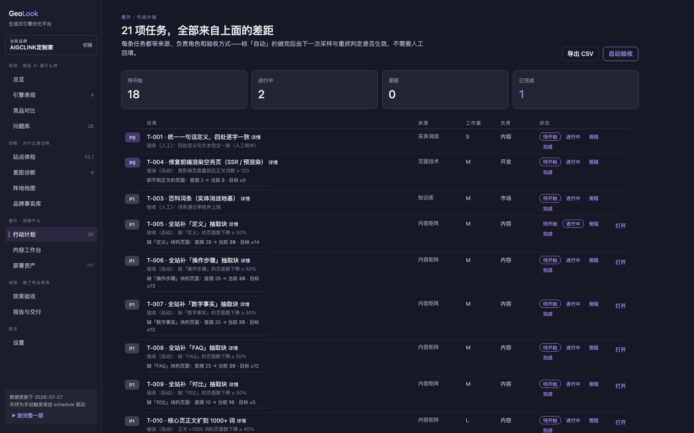

<div align="center">

# Geo**Look**  ·  302.AI / OpenRouter 版本

**开源的全流程 GEO 实施平台 · 自托管 · 一把 Key 走天下**

面向具体项目：现状分析 → 诊断 → 方案 → 实施计划工单 → 执行落地 → 效果验收


🔍 [在线演示（只读）](https://geolook.cc/demo/)

</div>

> GEO = 生成式引擎优化（Generative Engine Optimization）：让 DeepSeek、豆包、ChatGPT、Perplexity 这些 AI 引擎在回答用户问题时，**主动提到并引用你的品牌**。不是地理信息，也不是传统 SEO。

## ⚡ 302.AI 模式（推荐）

> **一把 API Key 调用全部 10 个 LLM 平台 + 9 个搜索 provider**。原生集成，开箱即用。

**之前**：要给 9 个 LLM 平台（DeepSeek / 豆包 / Claude / GPT / Gemini / GLM / Kimi / Perplexity / Grok / MiniMax）分别申请 Key、配 base URL、处理 3 种协议（OpenAI / Anthropic / 火山方舟）。

**现在**（302.AI 模式）：一把 Key 全部搞定，默认模型**全部升级到 2026-08 最新稳定版**。

### 安装和使用很简单：

在workbuddy，codex, claude code，等平台：
直接命令要求安装skill:<https://github.com/liangdabiao/geolook>

注册302.AI Key：<https://www.302.ai/302ai-key>
把302.AI Key 告诉你的AI

**一句话使用：**

请帮忙  GeoLook skill 调研  小米手机品牌

如果需要UI界面查看细节， 告诉AI ：请打开UI, 展示刚才完成的小米手机报告

就是这么简单的安装和使用，下面的内容不需要看了，直接使用即可。




### 速览

| 对比项                | 多 Key 模式                       | **302.AI 模式**                                                                                                           |
| ------------------ | ------------------------------ | ----------------------------------------------------------------------------------------------------------------------- |
| Key 数量             | 9                              | **1**                                                                                                                   |
| 协议                 | 3 种（OpenAI / Anthropic / 火山方舟） | 2 种（OpenAI / Anthropic）                                                                                                 |
| 平台支持               | 9 个 LLM                        | 9 个 LLM（一把 Key 通用）                                                                                                      |
| **联网搜索**           | 豆包 ark + Perplexity 共 2 个      | **9 个搜索 provider**（bocha / tavily / exa / metaso / firecrawl / perplexity / unifuncs / search1\_search / search1\_news） |
| 模型版本               | 用户手动维护                         | **默认 2026-08 最新**（gpt-5.4-mini / claude-sonnet-5 / gemini-3.5-flash / deepseek-v4-flash / ...）                          |
| Claude Opus 4.6 价格 | 官方 $15 / 1M                    | 302.AI 折后 **$5 / 1M**（3 倍便宜）                                                                                            |
| Windows 兼容         | ❌ 需 WSL（用了 `fcntl`）            | ✅ **已加** **`try/except`** **兜底**，系统代理自动检测                                                                               |
| 切换                 | 改多份配置                          | 改一个 `AI302AI_MODE=0/1`                                                                                                  |

### 9 个搜索 provider（默认按市场分流：cn→bocha，global→tavily）

| Provider        | 市场      | 强项                                        | 实测                            |
| --------------- | ------- | ----------------------------------------- | ----------------------------- |
| **bocha**       | 🇨🇳 默认 | 中文搜索质量最好                                  | ✅                             |
| **tavily**      | 🌍 默认   | 英文/海外搜索质量最好                               | ✅                             |
| exa             | 🌍      | 研究论文 / GitHub / 推特（高质量检索）                 | ✅                             |
| metaso          | 🌍      | 学术 / 播客 / 视频（深度研究）                        | ✅                             |
| **firecrawl**   | 🌍      | **带整页爬取**（可拿全文做内容分析）                      | ✅ 直击 GitHub repo              |
| search1\_search | 🌍      | **13 平台聚合**（google/微信/b站/github/arxiv...） | ✅                             |
| search1\_news   | 🌍      | 偏新闻版                                      | ✅                             |
| perplexity      | 🌍      | 与 perplexity LLM 同源                       | ✅                             |
| unifuncs        | 🇨🇳    | 中文深度调研                                    | ⚠️ 服务端 500（与代码无关，自动 fallback） |

### 编程用法

```python
# scripts/sample.py 提供的能力
import sample

# 1) 纯搜索（9 个 provider 任选）
sample.search("GeoLook GEO 工具", provider="bocha", count=5)

# 2) 一问多平台对比
for plat in ["deepseek", "claude", "gemini"]:
    r = sample.ask(plat, "X 跟 Y 比有什么优势？", search_provider="tavily")
    print(plat, "→", r["answer"][:80], " | 引用", len(r.get("search_citations", [])))

# 3) search_then_ask：搜索结果直接喂给 LLM（302.AI 模式下豆包 ark 联网的替代方案）
r = sample.ask("doubao", "什么是 GEO 优化？", timeout=60)
# 内部：bocha 搜 5 条 → 拼 prompt → doubao-seed-2-1-turbo-260628 回答
# 返回带 search_citations（5 条带 URL 的引用）
```

详细调研见 [docs/302ai-integration-research.md](docs/302ai-integration-research.md)。

***

## 🌐 OpenRouter 模式（与 302.AI 并列）

> **和 302.AI 互斥使用（只配一个聚合器）**。OpenRouter 是西方主流模型聚合器，**独家拥有 MiniMax-M3 (1M 多模态) + Llama / Mistral / Qwen / Cohere**。

### 为什么再加一个聚合器？

| 维度 | 302.AI | **OpenRouter** |
|---|---|---|
| **Key 数量** | 1 把 | 1 把 |
| **LLM 平台** | 9 个（含豆包全系）| **10 个**（含 bytedance-seed 豆包系列）|
| **西方主流模型** | 仅 Claude/GPT/Gemini/Perplexity/Grok | **+ Llama / Mistral / Qwen / Cohere / Nova / Gemma** |
| **独家模型** | 豆包 ark 协议 (`doubao-seed-2-1-turbo-260628`) | **MiniMax-M3** (1M 多模态) + **MiniMax-01** (4M context) + Hailuo 2.3 (视频) + Speech 2.8 (TTS) |
| **多源搜索** | ✅ 9 provider（bocha/tavily/exa/...）| ❌ 靠模型自带（Perplexity sonar / Claude web_search / GPT-4o search）|
| **协议** | OpenAI + Anthropic 双协议 | OpenAI 单协议 |
| **Claude Opus 4.6** | $5 / 1M | **$3-4 / 1M**（DeepInfra 折扣，更便宜 30-50%）|
| **覆盖场景** | 国内 + 多源搜索 + 豆包原厂 | 海外 + 多模型 + 多模态研究 |

### 配置方法

`.env` 加 3 行（与 302.AI 互斥——**设 OpenRouter 启用时会自动关闭 302.AI**）：

```bash
OPENROUTER_MODE=1
OPENROUTER_API_KEY=sk-or-v1-你的OpenRouterKey
# 可选：覆盖默认模型（不填用 2026-08 最新）
OPENROUTER_OPENAI_MODEL=openai/gpt-5.5
OPENROUTER_CLAUDE_MODEL=anthropic/claude-sonnet-5
OPENROUTER_MINIMAX_MODEL=minimax/minimax-m2.7  # 也能上 minimax/minimax-m3（1M 多模态）
OPENROUTER_ARK_MODEL=bytedance-seed/seed-2.0-mini  # 豆包系列
```

申请 OpenRouter Key：<https://openrouter.ai/keys>

### 10 个 LLM 平台覆盖（默认 2026-08 最新）

| 平台 | OpenRouter 模型 ID | 备注 |
|---|---|---|
| DeepSeek | `deepseek/deepseek-v4-flash` | |
| Kimi | `moonshotai/kimi-k3` | |
| MiniMax | `minimax/minimax-m2.7` | **M3 1M 多模态也支持**：设 `OPENROUTER_MINIMAX_MODEL=minimax/minimax-m3` |
| GLM | `z-ai/glm-4.7-flash` | 智谱在 OpenRouter 上品牌是 Z.AI |
| Gemini | `google/gemini-3.5-flash` | |
| OpenAI | `openai/gpt-5.5` | |
| Claude | `anthropic/claude-sonnet-5` | |
| Grok | `x-ai/grok-4.3` | |
| Perplexity | `perplexity/sonar` | 自带 citations（搜索结果）|
| 豆包 | `bytedance-seed/seed-2.0-mini` | OpenRouter 上字节用 bytedance-seed 命名 |

> **GLM 独家小贴士**：OpenRouter 上智谱品牌是 **Z.AI**（不是 zhipu），前缀用 `z-ai/`。

### 怎么选？

| 你的主要需求 | 推荐 | 理由 |
|---|---|---|
| 国内品牌 / 中文搜索 / 豆包原厂 | **302.AI** | 9 搜索 + 豆包 doubao-seed 全系 |
| 海外品牌 / 想要 Llama / Mistral / Qwen | **OpenRouter** | 西方模型最全 |
| 多模态 / 视觉 / 长上下文 | **OpenRouter** | M3 1M context + GPT-5 vision + Claude vision |
| 极致便宜 + 不需要多源搜索 | **OpenRouter** | Claude Opus 4.6 比 302.AI 还便宜 30-50% |
| 同时要 9 搜索 + MiniMax-M3 | 互斥二选一 | 用户规则：只配一个聚合器 |

### 联网能力（OpenRouter 没有原生多源搜索）

- **首选 Perplexity sonar**（自带 citations，5-10 条引用源）—— `ask("perplexity", ..., search_provider=None)`
- **Claude web_search 工具**（海外最强时效）—— 需在 `.env` 加 `OPENROUTER_EXTRA_CLAUDE='{"tools":[{"type":"web_search_20250305"}]}'`
- **GPT-4o search preview**（OpenAI 自带）—— 设 `OPENROUTER_OPENAI_MODEL=openai/gpt-4o-search-preview`
- **firecrawl 整页爬**——`sample.search("...", provider="firecrawl", count=5)` 自动带全文

详细调研：[docs/openrouter-integration-research.md](docs/openrouter-integration-research.md)

***

## 一、解决什么问题

越来越多的用户直接问 AI「有哪些好用的 XX 工具」「XX 和 YY 哪个好」。如果你的品牌：

| 问题                           | GeoLook 给的答案                                      |
| ---------------------------- | ------------------------------------------------- |
| **AI 根本不提你**——搜品类问题时你不在候选集里  | 逐引擎采样真实回答，量化提及率/位次/引用份额，诊断出「完全缺席」还是「竞品主导」         |
| **不知道为什么不提你**——AI 是黑盒        | 六维站点体检 + 差距诊断：抓不到正文？缺抽取块？没铺 AI 实际引用的阵地？口径不一致？逐项定位 |
| **知道该做但落不了地**——建议一堆，没人执行没人验收 | 生成带验收标准的实施工单，86% 可由程序自动验收（示例项目 18/21），做没做完不靠口头确认  |
| **做了不知道有没有用**                | 逐题前后期采样对比 + 任务级 before/after，哪些动作真的让 AI 改了口，有数    |
| **给客户做 GEO 服务，交付难**          | 一键产出诊断报告、优化方案、执行方案、工单 CSV、验收表的完整交付包               |

## 二、功能全景

四段主线 + 运营能力，全部在一个自托管看板里：

### 现状 · 我在 AI 里什么样

- **引擎表现**：国内海外 15 个引擎（10 个 API 自动采样 + 5 个人工采样表），每个引擎的提及率、提及位次、引用份额、它实际在引用谁、**样本回放**（真实回答原文，品牌命中高亮）、疑似负面标记
- **品牌提及分布**：单引擎与全引擎汇总，回答里你和竞品各占多少（国内/海外分开算）
- **竞品对比**：同一批无提示样本下的对手出现率；**每个对手最强的引擎**一键联动；「被抢走的问题」「你独占的问题」直接变成选题池
- **问题库**：七组问题（推荐/比较/替代/价格/风险/品牌验证/场景），每题带**诊断分型**（疑似负面 > 竞品主导 > 完全缺席 > 排名靠后），点名探测题单独归类不污染指标


### 诊断 · 为什么是这样

- **站点体检**：robots 封禁 / sitemap / llms.txt / 页面可访问 / 语言覆盖 / 抽取块缺口，六维打分；点等级或缺块直接筛选问题页、直达修复工单
- **差距诊断**：内容缺口 → 阵地缺口 → 事实偏差，三类按「先修哪个」排序
- **阵地地图**：19 个阵地（百科/榜单站/公众号/头条/知乎/技术社区/G2/Wikipedia/Reddit/YouTube…）按真实引用语料标注分量与优先级；每个阵地写清**建什么、建多少、节奏、谁来做**
- **品牌事实库**：全站唯一口径来源——llms.txt、JSON-LD、内容草稿都从这里取事实；AI 说法逐条比对，比对过「事实一致性」才进健康分



### 提升 · 该做什么

- **行动计划**：结构化工单（依据/负责角色/工作量/时间窗口/验收标准），标「自动」的由重抓站点 + 下期采样判定；量化工单显示「首测 → 当前 → 目标」进度条，回归自动打回
- **内容工作台**：选题池按「未提及 + 无内容」排序；写稿时左侧给必含抽取块与品牌事实，右侧实时**可被引用度预检**；AI 初稿必须过编造风险 lint；**分发清单**按问题类别匹配目标阵地，铺完打勾
- **部署资产**：llms.txt、JSON-LD（Organization/FAQ/Article…）、定义块与 FAQ 的 HTML 片段，每个文件标注去处；DEPLOY.md 给开发的部署清单含验收标准
- **发布渠道**：成稿一键发到 GitHub / WordPress 草稿 / 公众号草稿箱 / 自定义 Webhook——凭证在本地 `.env`，每次发布人工确认，无任何自动外发路径




### 成效 · 做了有没有用

- **效果验收**：逐题前后期提及率对比（全部/国内/海外分 tab）、任务级 before/after、验收历史
- **报告与交付**：给老板的一页结论、给执行团队的分批执行方案、给客户的完整交付包（HTML + CSV）

### 运营

- **周期复跑**：每 7/14/30 天自动跑完整一期，做长期运营与月报
- **多品牌**：一个实例管多个项目，数据互相隔离，侧栏一键切换
- **人工采样闭环**：无 API 的引擎导出采样表，人工/浏览器填完回灌，与自动采样同一套指标

## 三、和市面 GEO 工具的区别

市面上的 GEO 产品绝大多数是**监测型 SaaS**：告诉你提及率和排名，按月收订阅费，数据在别人云上。GeoLook 的定位是**实施平台**，差别在这几处：

| <br />   | 典型 GEO 监测 SaaS | GeoLook                                                                                 |
| -------- | -------------- | --------------------------------------------------------------------------------------- |
| **闭环深度** | 监测 + 建议        | 监测 → 诊断 → **工单 → 资产 → 自动验收 → 交付**，落地全流程                                                 |
| **验收方式** | 无（或人工回填）       | 程序判定：重抓站点 + 下期采样自动验收，回归自动打回                                                             |
| **指标口径** | 黑盒算法           | 全部可复现，界面里点开「这些数字怎么来的」查完整口径；算不出显示「未测」，不编数                                                |
| **中文市场** | 多为海外引擎         | 国内引擎矩阵（GLM/豆包/DeepSeek/Kimi/MiniMax/纳米/百度AI）+ 按国内引用语料标定的阵地（百科/榜单站/公众号/头条…），国内海外分开出题分开算  |
| **评分依据** | 经验规则           | 锚定公开实证数据：602 条 Prompt / 21,143 条引用 / CN-GEO 187,818 条国内去重引用（[references/](references/)） |
| **数据归属** | 厂商云端           | **全部在你本机** `work/` 目录（JSON/Markdown），git 一下就是备份                                         |
| **成本**   | 按月订阅           | 开源免费，只花你自己的引擎 API 采样费（可为零：纯人工采样也能跑）                                                     |
| **交付能力** | 截图仪表盘          | 直接产出可发客户的诊断报告/优化方案/执行方案/工单表，适合代理商与顾问                                                    |

诚实说明边界：GeoLook 是单机工具，没有账号体系和团队协作；采样频率与样本量由你自己的 API 预算决定；「疑似负面」等判定是线索提示，定性仍需人工复核——这些是刻意的设计取舍，不是还没做完。

## 四、部署教程

### 环境要求

- macOS / Linux / **Windows（已支持）**
- Python **3.10+**
- 唯三的第三方依赖：`requests`、`beautifulsoup4`、`lxml`
- Windows 用户的 `fcntl` 锁与系统代理已做自动兼容，无需 WSL

### 三步跑起来

```bash
# 1. 克隆并安装依赖
git clone https://github.com/liangdabiao/geolook.git
cd geolook
pip3 install requests beautifulsoup4 lxml

# 2. 启动看板（自动打开浏览器）
python3 scripts/geo.py ui        # → http://127.0.0.1:8765

# 3.（推荐）配置聚合器 Key —— 一把 Key 解锁 10 个 LLM 平台
cp .env.example .env
# 编辑 .env，二选一：
#   方案 A（推荐国内）：AI302AI_MODE=1 + AI302AI_API_KEY=sk-你的302AI密钥
#   方案 B（推荐海外）：OPENROUTER_MODE=1 + OPENROUTER_API_KEY=sk-or-v1-你的OpenRouter密钥
# 看板「设置 → 引擎与密钥」里点对应卡片的「启用」按钮也可，自动写进本地 .env
```

**不配任何 Key 也能用**：自动采样会跳过，改用「导出人工采样表 → 人工/浏览器采样 → 回灌」的流程；抓站、体检、工单、资产等功能不依赖任何 Key。配一个国内引擎 Key（如 DeepSeek/GLM）即可解锁「自动推导问题库/品牌事实」和「AI 初稿」。

### 引擎 Key 的三种配置方式

| 方式                                | 适用                       | 配置                                                |
| --------------------------------- | ------------------------ | ------------------------------------------------- |
| **A. 302.AI 模式（推荐国内）**           | 一把 Key + 多源搜索 + 豆包原厂      | `AI302AI_MODE=1` + `AI302AI_API_KEY`              |
| **B. OpenRouter 模式（推荐海外）**       | MiniMax-M3 多模态 + Llama/Qwen | `OPENROUTER_MODE=1` + `OPENROUTER_API_KEY`        |
| **C. 多 Key 模式**                   | 已有各大平台账号 / 想要直连          | 每个平台 1 个环境变量（见 [.env.example](.env.example)）     |

**A / B 互斥不冲突**：两个聚合器只配一个（启用一个会自动关闭另一个）。`AI302AI_MODE=0` 且 `OPENROUTER_MODE=0` 时走 C（多 Key）。

### 服务器/远程部署

服务只绑定 `127.0.0.1`（刻意的安全边界，无认证体系）。要远程访问：

```bash
# 推荐：SSH 隧道
ssh -N -L 8765:127.0.0.1:8765 user@your-server
# 然后本地浏览器打开 http://127.0.0.1:8765
```

多人使用请自行加反向代理 + 认证（nginx basic auth / OAuth proxy 等）。`.env` 与 `work/` 含密钥和项目数据，注意文件权限。

### 升级

```bash
git pull        # 数据在 work/ 与 .env，均被 gitignore，升级不影响
```

## 五、使用教程

### 路线 A：一条命令全自动（约 10–30 分钟）

```bash
python3 scripts/geo.py new --url https://example.com --market both
```

`--market` 取 `cn` / `global` / `both`。九步自动完成：抓站 → 体检 → 推导品牌事实/竞品/问题库 → 逐引擎采样 → 生成工单 → 产出资产 → 报告 → 自动验收 → 交付包。产出在 `work/<项目>/delivery/<日期>/`。

### 路线 B：看板逐步走（推荐首次使用）

**第 1 步 · 接入品牌**：`python3 scripts/geo.py ui` → 首次进入自动到接入引导，填官网域名、选目标市场，点「创建并开始自动引导」。后台自动跑完首期（可关页面，任务照跑）。

**第 2 步 · 人工核对底座**（重要，10 分钟）：自动推导只从官网正文抽取，抽不到的标「待确认」。到「**品牌事实库**」核对口径、补别名与关键数字；到「**问题库**」检查题目是否像真实用户问法（漏配别名会低估提及率）。

**第 3 步 · 看现状**：「总览」一句结论 + 健康分五项；「引擎表现」逐引擎下钻，点样本回放看 AI 原话，发现说错的点「记一条事实偏差」；「竞品对比」看对手最强的引擎——那就是你要去建设的信源。

**第 4 步 · 看诊断**：「站点体检」技术层（点缺块直达修复工单）→「差距诊断」内容/阵地/事实三类缺口 →「阵地地图」每个阵地点开看建设方案（建什么/建多少/节奏/谁来做）。

**第 5 步 · 执行**：

- 「行动计划」按 P0→P1 领工单，点标题看详情（为什么做/具体怎么干/怎么算做完）
- 「内容工作台」从选题池选题 → 按大纲写稿（右侧预检达到 B 以上）→「发布为成稿」→ **分发清单**告诉你该铺到哪些阵地，铺完打勾
- 「部署资产」把 llms.txt 传网站根目录、JSON-LD 贴进 `<head>`、片段贴进模板（每个文件顶部写了去处，完整清单见 DEPLOY.md）

**第 6 步 · 验收**：「设置 → 运行任务」点「自动验收」（重抓站点判定工单）；下一期采样后到「效果验收」看逐题 before/after。

**第 7 步 · 长期运营**：「设置」开启周期复跑（每 7/14/30 天自动跑一期）；「报告与交付」生成月报与客户交付包。

### 无 API 引擎的人工采样

```bash
python3 scripts/geo.py sample-sheet --slug <项目>    # 导出采样表（含每题指引）
# 人工/浏览器在纳米AI、百度AI、ChatGPT网页版等提问并粘贴回答
python3 scripts/geo.py sample-import --slug <项目> --file <采样表>
```

也可在看板「设置 → 运行任务」里点「导出人工采样表」，「引擎表现」页导入。

### CLI 速查

| 命令                                               | 作用                                 |
| ------------------------------------------------ | ---------------------------------- |
| `new` / `serve` / `cycle`                        | 全自动新项目 / 已有项目跑完整一期 / 轻量循环          |
| `ui`                                             | 全流程看板                              |
| `bootstrap` / `crawl` / `audit`                  | 推导底座 / 抓站 / 六维打分                   |
| `sample` / `sample-sheet` / `sample-import`      | API 采样 / 人工采样表导出与回灌                |
| `plan` / `generate` / `lint`                     | 生成工单 / 生成资产（`--draft` 出初稿）/ 初稿风险检查 |
| `verify` / `report` / `deliverables` / `deliver` | 自动验收 / 报告 / 三份交付物 / 客户交付包          |
| `publish` / `task` / `status` / `list`           | 发布成稿 / 工单状态 / 项目看板 / 项目列表          |

每条命令 `--help` 有完整参数。

### 302.AI 模式 CLI / Python 用法

```bash
# 检查 302.AI 配置
python3 -c "from scripts import sample; print(sample._ai302ai_enabled())"

# 单题多平台对比
python3 -c "from scripts import sample as s; \
  [print(p, '->', s.ask(p, 'X 跟 Y 比有什么优势？').get('answer','')[:60]) \
   for p in ['deepseek', 'claude', 'gemini', 'doubao']]"
```

```python
# 直接调 sample 模块的 API（更适合 agent / 自动化脚本）
import sample

# 9 个搜索 provider 任选（302.AI 模式下）
sample.search("GeoLook GEO 工具", provider="bocha", count=5)
sample.search("latest GEO paper",   provider="exa",   count=5, category="research paper")

# 单平台单题（agent 调试用）
sample.ask("deepseek", "X 跟 Y 比有什么优势？", search_provider="tavily")
```

### OpenRouter 模式 CLI / Python 用法

```bash
# 检查 OpenRouter 配置
python3 -c "from scripts import sample; print(sample._openrouter_enabled())"

# 单题多平台对比（10 个全跑）
python3 -c "from scripts import sample as s; \
  [print(p, '->', s.ask(p, 'X 跟 Y 比有什么优势？').get('answer','')[:60]) \
   for p in ['deepseek', 'claude', 'gemini', 'doubao', 'minimax']]"

# 用 MiniMax-M3（1M 多模态，需在 .env 设 OPENROUTER_MINIMAX_MODEL=minimax/minimax-m3）
python3 -c "from scripts import sample as s; print(s.ask('minimax', '详细分析这段 50KB 报告').get('answer',''))"
```

```python
# 直接调 sample 模块的 API
import sample

# 用 Perplexity sonar（自带 citations，等同 302.AI 搜索效果）
r = sample.ask("perplexity", "GeoLook GEO 工具")
print(r["answer"], "引用源:", len(r.get("search_citations", [])))

# 用 GLM（注意 OpenRouter 上是 z-ai/，已在 .env.example 默认配置好）
sample.ask("glm", "X 跟 Y 比有什么优势？")
```

**OpenRouter 联网选项**（无 9 搜索 provider，靠模型自带）：
- `ask("perplexity", ...)` — Perplexity sonar，5-10 条 citations
- `ask("claude", ..., extra={"tools":[{"type":"web_search_20250305"}]})` — Claude web_search
- `ask("openai", ...)` 时模型改为 `openai/gpt-4o-search-preview` — GPT 联网

## 评分依据

六个体检维度全部锚在公开实证数据上，`scripts/audit.py` 是 [references/method.md](references/method.md) 的代码实现。几条最有用的结论：

- 高影响力页面平均 **1,943 词**，低分页仅 170 词（11.4×）
- 含数字 **+61.6%**、定义 **+57.3%**、对比 **+55.3%**、how-to **+41.2%** 与研究中的页面影响力相关；它们用于内容就绪度诊断，不是单页效果保证
- 纯 Q\&A 排版反而 **−5.7%**——排成问答样子没用
- 对题性是最强预测因子（r = 0.432），高于权威度
- 品牌官网类信源只占国内全库引用的 **1.37%**——官网是事实源不是引用源，外部阵地才是引用来源

## 测量与趋势边界

- 审计分与 GEO 健康分是**诊断性就绪度指标**，帮助排优先级；不是 AI 一定会提及、引用或带来转化的概率。
- 每个新版采样冻结问题面板、实体目录、模型/route、终端和联网状态；仅当这些条件一致且样本完整时，报告才展示跨期变化。
- 首个新版采样建立新基线。旧 JSONL/metrics 不会被改写，可继续回放，但标为 `legacy / 不可比较`。
- `0%` 是成功样本中未命中；`未测`是没有可用分母；`样本不完整`是采集存在失败；不可将它们混写。
- 所有变化均为观察性结果。要作因果归因，仍需另行设计基线窗口、对照 Prompt、竞品对照与外部事件记录。

---

## 设计原则与安全边界

- **单机自托管**：标准库 `http.server` 只绑 127.0.0.1；无数据库无账号，数据即文件
- **宁缺毋滥**：品牌事实只从官网正文抽取，抽不到标「待确认」；竞品严禁发明名字；AI 初稿必须过 lint 并人工核实
- **验收即产品**：能自动判定的绝不靠人回填
- **发布永远手动**：渠道凭证在本地 `.env`（权限 600），每次发布人工点击确认；公众号/WordPress 只进草稿箱

## 与 Claude Code 集成（可选）

本仓库同时是一个 Claude Code 技能（[SKILL.md](SKILL.md)）：放进技能目录后对 Claude 说「给 example.com 做 GEO」即可驱动全流程。不用 Claude 也完全可用——所有脚本都是普通 CLI。

## 目录结构

```
scripts/          全部逻辑（geo.py CLI 入口 · dashboard.py 看板服务 · ui.html 单页前端）
references/       方法论：采样纪律、内容模式实测、国内外平台引用结构
tests/            单元测试
work/<slug>/      每个项目的全部数据（gitignore，不出本机）
docs/             截图与 40 秒演示视频
```

## 致谢

- [@yaojingang](https://github.com/yaojingang)

## 更新日志

### 2026-08-04 · 302.AI 原生集成

**一把 Key 替代 9 把**：

- 新增 `AI302AI_MODE=1` + `AI302AI_API_KEY` 模式：所有 LLM 平台走 302.AI 统一端点 `https://api.302.ai/v1/`
- 10 个平台默认模型**全部升级到 2026-08 最新稳定版**：
  - `gpt-5.4-mini` / `claude-sonnet-5` / `gemini-3.5-flash` / `deepseek-v4-flash`
  - `glm-4.7-flashx` / `kimi-k3` / `doubao-seed-2-1-turbo-260628`
  - `MiniMax-M2.7` / `grok-4.1` / `sonar`
- 协议归一：3 种协议（OpenAI / Anthropic / 火山方舟）→ 2 种（OpenAI / Anthropic）
- Claude Opus 4.6 走 302.AI 比官方便宜 3 倍

**9 个搜索 provider 集成**（[sample.py](scripts/sample.py)）：

- 新增 `search(query, provider, count)` 函数
- `search_then_ask()` 组合：搜索结果自动拼到 LLM prompt
- 自动按市场分流：cn → `bocha`，global → `tavily`
- 实测 8/9 跑通（`unifuncs` 是 302.AI 服务端 500，与代码无关）
- 9 provider：`bocha` / `tavily` / `exa` / `metaso` / `firecrawl` / `perplexity` / `unifuncs` / `search1_search` / `search1_news`
- `search1_search` 聚合 13 平台（google/微信/b站/github/arxiv...）
- `firecrawl` 带整页爬取，实测直击 GitHub repo

**Windows 兼容**（[geolib.py](scripts/geolib.py)）：

- `fcntl` 改为 `try/except ImportError` 兜底
- 系统代理自动检测（`netsh winhttp show proxy`）
- 看板在 Windows 上开箱即用，**不需要 WSL**

**`search_then_ask`** **修复**：

- 修了"豆包 ark → search\_then\_ask → ask → ark → 无限递归"bug
- 改走 `_ask_chat` 直接路径避免重入

详细调研：[docs/302ai-integration-research.md](docs/302ai-integration-research.md)
架构文档：[docs/ARCHITECTURE.md](docs/ARCHITECTURE.md)
Agent-Direct 模式调研：[docs/agent-skill-mode-research.md](docs/agent-skill-mode-research.md)

### 2026-08-04 · OpenRouter 并列接入（与 302.AI 互斥）

**为什么加 OpenRouter**：西方主流模型最全 + 独家 MiniMax-M3 (1M 多模态) + Llama / Mistral / Qwen + 比 302.AI 更便宜（Claude Opus 4.6 仅 $3-4/1M）。

**核心改动**：

- `OPENROUTER_MODE=1` + `OPENROUTER_API_KEY=sk-or-v1-...`：10/10 LLM 平台全覆盖（含豆包：`bytedance-seed/seed-2.0-mini`）
- 与 302.AI 互斥使用：UI 启用 OpenRouter 时自动关闭 302.AI（反之亦然）
- 协议：纯 OpenAI 兼容（OpenRouter 单协议，不支持 Anthropic `messages` 端点）
- 推荐 header：`HTTP-Referer` + `X-Title`（OpenRouter 排行榜归因，自动加）
- 4 个模型 ID 修正：GLM 用 `z-ai/` 前缀（不是 `zhipu/`）、Grok 用 `x-ai/grok-4.3`（不是 4.1）、OpenAI 用 `gpt-5.5`、豆包用 `bytedance-seed/seed-2.0-mini`
- 9 个 LLM 平台默认 2026-08 最新稳定版

**UI 改进**（[ui.html](scripts/ui.html)）：

- 设置页顶部 3 列 grid：302.AI 卡 + OpenRouter 卡 + 运行任务卡（紫色 vs 紫青色边框区分）
- 接入引导给 2 张并排卡（一键启用任一聚合器）
- OpenRouter 模态：`testOrKey()` 调 `/api/auth/key` 验证，`saveOpenrouter()` 写 Key + 模型覆盖
- "高级"折叠区过滤掉两个聚合器行

**`.env` 改键**：原"模式 B（兜底）：各平台原生 Key"改为模式 B，把 OpenRouter 升级为模式 C。

**`ask("doubao", ...)` 早拦截删除**：豆包现在 100% 覆盖（302.AI 走 ark 协议 / OpenRouter 走 bytedance-seed）。

**搜索能力**：OpenRouter 无原生 9 provider，靠 Perplexity sonar（自带 citations）/ Claude web_search / GPT-4o search 三种模型自带能力。

**实测**：

- 2/10 模型实际跑通（DeepSeek + GLM 拿到 GeoLook 正确描述）
- 8/10 HTTP 402（用户 OpenRouter 试用 Key 余额不足，**不是代码 bug**）
- 1/10 HTTP 403（Claude 模型在用户区域不可用，OpenRouter 路由决定）

详细调研：[docs/openrouter-integration-research.md](docs/openrouter-integration-research.md)

### 2026-08-04 · 豆包纳入 OpenRouter 覆盖

**误判修正**：之前报告说"豆包在 OpenRouter 上无"是错的。OpenRouter 上字节用 `bytedance-seed/seed-2.0-mini`（不是 `doubao-seed-*` 命名），10/10 平台全打通。

### 2026-08-04 · 引擎与 UI 全面改造

***

## License

[MIT](LICENSE)

<https://linux.do> 感谢佬友
